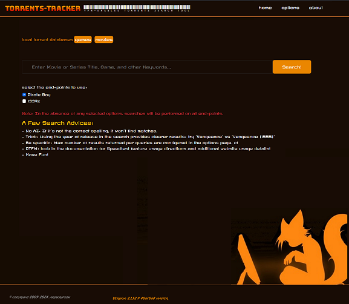
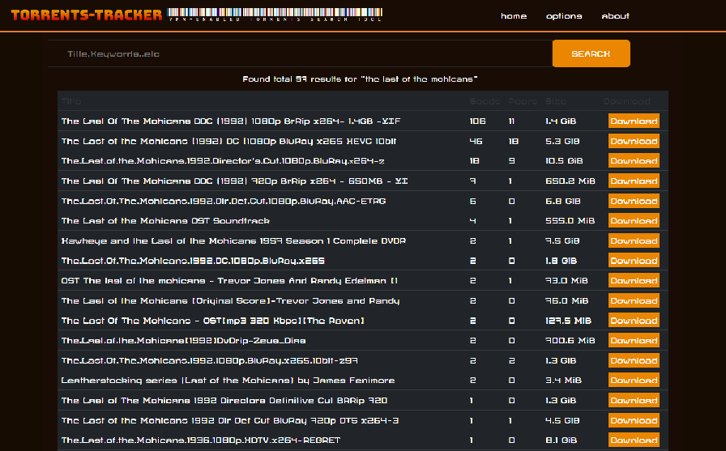
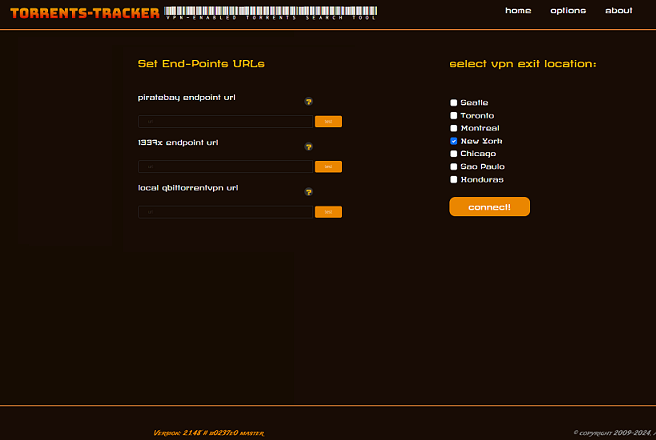
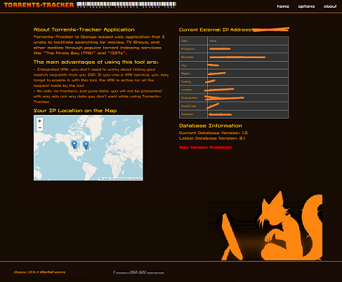
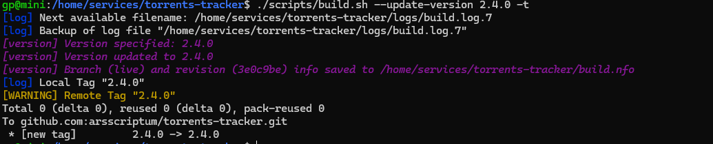
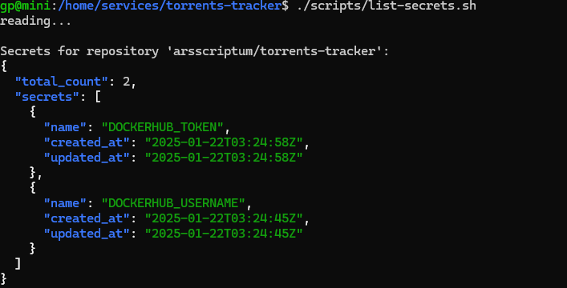
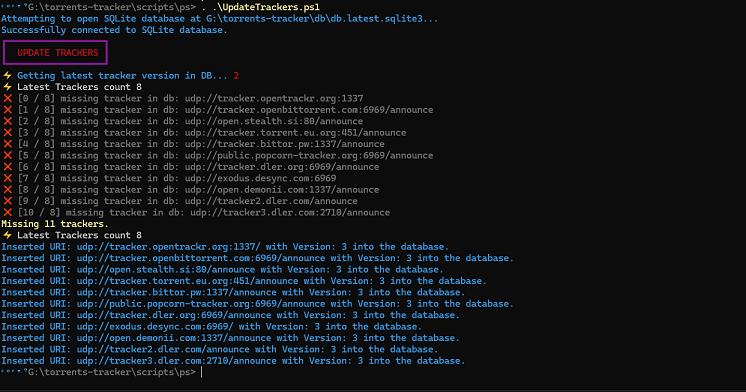
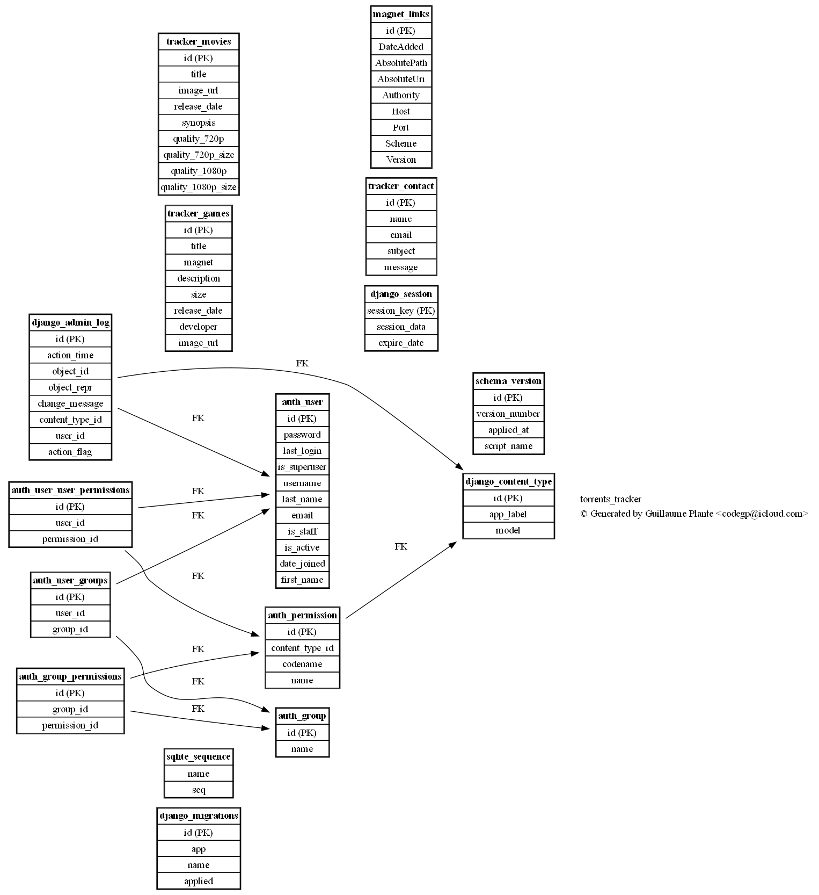

<center></center>

**TORRENTS TRACKER**

Torrents-Tracker is my very own tool to search for torrents by leveraging the PirateBay search engine. 

I enjoy the latest movies, tv shows and wanted a tool to make my life easier. It's clean, secure, simple and **just works** . This tool is supposed to be **fun** and **pleasant** to use.

## Features

1. **Docker-Compose Image**: So I can run the service along with other services on my media server, all managed by Portainer
2. **Integrated VPN**: using [docker-transmission-openvpn](https://arsscriptum.github.io/docker-transmission-openvpn/) so all the requests done to the torrents indexers is encrypted and routed through the VPN tunnel, preventing the user's actual IP address from being exposed
3. **QTorrentVPN Integration**: So that when I find torrents to download, they are added automatically to the download queue in QBittorrent using the rest api, no more copy/pasting links left and right
4. **Concurrent Scraping**: Utilizes Python modules like `asyncio` to perform multiple web scraping requests simultaneously, significantly reducing the total time spent in scraping.
5. **Integration of TMDB API**: using TMDB to retreive media extended information in real-time to give recent information regarding the search files.
6. **Discovery Feature for the undecided**: There's a section in the tool where you find all the titles that are on the bleeding edge of media availabilities, as well as providing movie / tc show ideas if you are undecided on what to watch
7. **VPN Exit node location visualizer**: This integrated feature uses a map to locate the geographical location related to the IP that was assigned to you by the VPN service. Easy to confirm you are using a VPN and that you are in fact not on your ISP's servers.

## Looks and Feel

### UI Overview


| **SEARCH** |  |  |
|-----------------------------|-----------------------------|-----------------------------|
| **OPTIONS** and **ABOUT** |  |  |


## Project Tasks

**work in progress**

Because I feel documentation is lacking, I'll be priorizing high-impact/low-effort tasks, this means design description, details on modes of operation and troubleshooting.

I don't know if I will regret this, but I can offer minimal support since I am already helping my friend. ***Marieve, oui c toi, profites-en*** So if you identify a bug, a missing piece of information or if you have a constructive comment, [arsscriptum@proton.me](mailto:arsscriptum@proton.me)

- [⚠️] todo: explain how to update the torrents indexers that are hardcoded in     <!-- ⚠️ Needs clarification -->
- [✅] doc: Explain how to configure your own VPN service
- [x]  How to Build
- [x] Install as a Service
- [ ] Docker Image
- [ ] Mode of Operation: draw schema, list ordered operations and generate referenced information
- [ ] PicoTorrent Integration: PicoTorrentAPI (wheb you click Download, explain that happens)
- [ ] How to test the connection speed on your VPN using my embedded test tool.


---

**Legend:**  
- `[ ]` = To do  
- `[x]` = Completed (✅)  
- `<!-- ⚠️ ... -->` = Note (⚠️)  


## How to Build

```bash
./scripts/build.sh 
```

```bash

build.sh options

Usage: ./scripts/build.sh [options]
  -c, --clean             Completely rebuilds images without cache, which ensures no old layers are reused
  -i, --incremental       Incremental build
  -a, --async             Runs the containers in the background (detached mode)
  -t, --tag               Tag Build
  -d, --debug             DEBUG MODE (no VPN)
  -r, --run               Run the image as well
  -V, --update-version    Update Version
  -h, --help              Show this help message
```

## Github Action Build 

Updating the tag with a version ending with ```0``` 



```bash
./scripts/build.sh --update-version 4.2.0 -t
```

## Environment Variable

Generate the ```.env``` file using different scripts availables (PowerShell, Bash), or decrypt ```./data/env.aes```

Personally, I put the ```.env``` file elsewhere on my server, so I added this in ```docker-compose.yml```

```yml
    env_file:
      - /home/storage/Configs/.env
```

This file contains the values of the vpn username and vpn password:

```
OPENVPN_USERNAME=<user>
OPENVPN_PASSWORD=<pass>
```


#### Other VPN configuration

 - OPENVPN_PROVIDER : [your provider](https://arsscriptum.github.io/docker-transmission-openvpn/supported-providers/)
 - OPENVPN_CONFIG : where you connect


### Testing Secrets

Use the script ```./scripts/list-secrets.sh```



```
gp@mini:/home/services/torrents-tracker$ ./scripts/list-secrets.sh
reading...

Secrets for repository 'arsscriptum/torrents-tracker':
{
  "total_count": 2,
  "secrets": [
    {
      "name": "DOCKERHUB_TOKEN",
      "created_at": "2025-01-22T03:24:58Z",
      "updated_at": "2025-01-22T03:24:58Z"
    },
    {
      "name": "DOCKERHUB_USERNAME",
      "created_at": "2025-01-22T03:24:45Z",
      "updated_at": "2025-01-22T03:24:45Z"
    }
  ]
}
```

## Advanced Scripts and Tweaks

#### Updating Trackers

The latest trackers can be fetched on the associated website (Pbay for Pbay trackers, etc...). I have made a [powershell script](scripts/ps/UpdateTrackers.ps1) to list them.


### Example 



## Prerequisites

### The Movie Database

To use the **Discover** feature, you need a [TMDB](https://developer.themoviedb.org/docs/getting-started) account and api token.

This is how we can find the list of currently available movies, popular titles and trending films. If you need help or support, please head over to the [API support forum](https://www.themoviedb.org/talk/category/5047958519c29526b50017d6).

To register for an API key, click the [API link](https://www.themoviedb.org/settings/api) from within your account settings page.

###  Dependencies

Before you begin, ensure you have the following software installed:

- [Download Python 3.x](https://www.python.org/downloads/)
- [Django](https://www.djangoproject.com/download/)
- [Docker Compose](https://docs.docker.com/compose/)


### Docker Compose Configuration

You need to update your `docker-compose.yml` to configure such things as VPN and network.

- **command**: This runs the Django development server on `0.0.0.0:7070`.
- **ports**: Exposes port `7070` externally so you can access the app via `http://0.0.0.0:7070`.
- **volumes**: Create those directories on your server and set the access rights before starting the app.
- **vpn configuration files**: Copy them in ```/srv/vpn/config``` or other linked forder to ```/config```

#### Database View



#### Version generation

Avoid version files generation to mess your commits:

```bash
git update-index --assume-unchanged version.nfo
git update-index --assume-unchanged build.nfo
```

### Using Polkit to bypass Authentication

Polkit (PolicyKit), a component in Linux systems that provides an authorization framework for defining and enforcing access policies for privileged system operations.

Polkit rules determine who can perform specific actions or interact with system services without being prompted for authentication (e.g., password). These rules offer fine-grained control over what users, groups, or conditions are authorized to perform certain actions.

### Allow $USER to Stop and Start the Service Without Authentication**

If `$USER` frequently stops `torrents-tracker.service`, configure Polkit to allow this without authentication.

#### Create a Polkit Rule:
1. Create a file in `/etc/polkit-1/rules.d/`:
   ```bash
   sudo nano /etc/polkit-1/rules.d/90-torrents-tracker.rules
   ```

2. Add the following rule:
   ```javascript
   polkit.addRule(function(action, subject) {
       if (action.id == "org.freedesktop.systemd1.manage-units" &&
           action.lookup("unit") == "torrents-tracker.service" &&
           subject.isInGroup("gp")) {
           return polkit.Result.YES;
       }
   });
   ```

3. Save and close the file.

#### Reload Polkit:
```bash
sudo systemctl restart polkit
```

---

### **4. Test **
Now, try stopping the service:
```bash
systemctl stop torrents-tracker.service
```

You should no longer see the duplicate identities or be prompted for authentication.

You can create an alias to start the `torrents-tracker.service` using either your shell configuration file or a system alias mechanism. Below are the steps:

---

If you want the alias to be available system-wide for all users:
1. Edit the global aliases file:
   ```bash
   sudo nano /etc/bash.bashrc
   ```

2. Add the alias:
   ```bash
   alias start-tracker='systemctl start torrents-tracker.service'
   alias start-tracker='systemctl stop torrents-tracker.service'

   or 

   alias start-tracker='sudo systemctl start torrents-tracker.service'
   alias start-tracker='sudo systemctl stop torrents-tracker.service'
   ```

3. Save and exit the file.

4. Reload the global configuration:
   ```bash
   source /etc/bash.bashrc
   ```

5. Add this line to allow the `gp` user to manage `torrents-tracker.service` without a password:
   ```bash
   sudo visudo

   gp ALL=(ALL) NOPASSWD: /bin/systemctl start torrents-tracker.service
   gp ALL=(ALL) NOPASSWD: /bin/systemctl stop torrents-tracker.service
   ```

