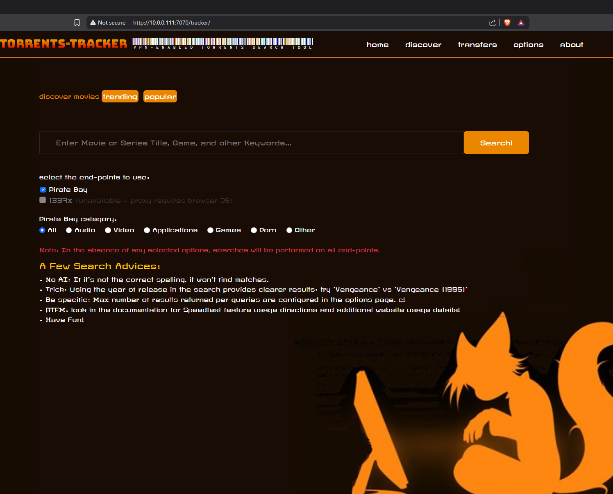
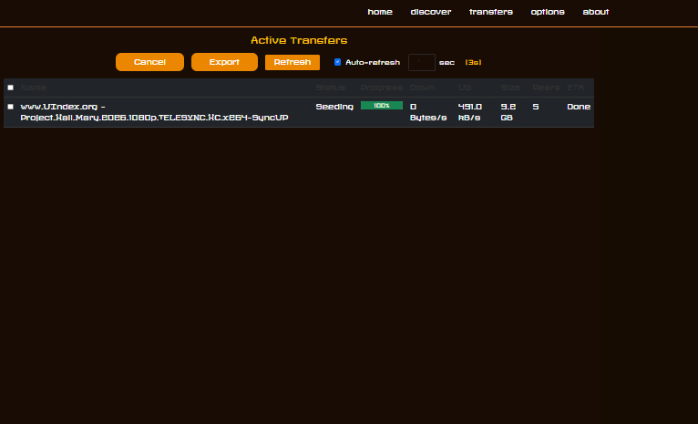
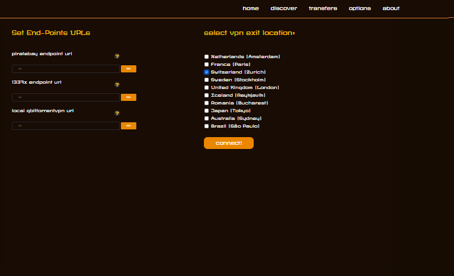
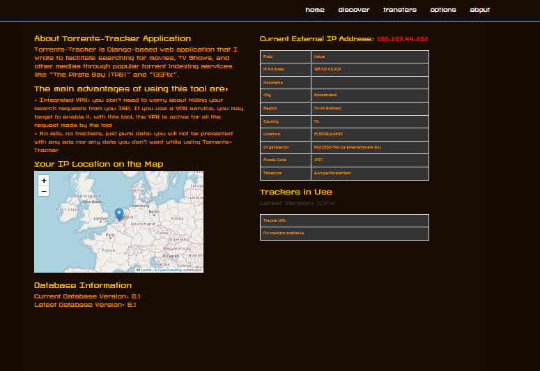

# Torrents-Tracker

Torrents-Tracker is a Django-based web application that provides a unified interface for searching and downloading torrents through popular indexing services such as The Pirate Bay. It runs behind a ProtonVPN tunnel so all torrent traffic and searches exit through an encrypted VPN connection — your real IP is never exposed to trackers or indexers.

The app integrates directly with a local Transmission daemon for download management, allowing you to add, monitor, and export transfers without leaving the browser.

---

## Pages

### Home — Search



The home page is the main search interface. Enter any movie title, series name, game, or keyword in the search bar and hit **Search!**.

**End-point selection** lets you choose which indexers to query:
- **Pirate Bay** — enabled by default, queries the configured Pirate Bay proxy endpoint.
- **1337x** — currently unavailable; proxies for this site require browser-side JavaScript execution that a server-side scraper cannot perform.

**Pirate Bay category filter** narrows results to: All, Audio, Video, Applications, Games, Porn, or Other.

A few search tips are displayed below the form:
- Spelling matters — there is no fuzzy/AI matching; if the title is wrong, no results come back.
- Including the release year significantly improves result accuracy (e.g. `Vengeance (1995)` vs `Vengeance`).
- The maximum number of results returned per query is configurable on the Options page.

---

### Discover


The Discover page surfaces **Trending** and **Popular** movies fetched from an external metadata source, displayed as a poster grid. Each card shows the title, year, and a thumbnail poster.

Toggle between **trending** and **popular** using the pill buttons at the top. Clicking a poster takes you to more details or initiates a search for that title.

---

### Transfers



The Transfers page shows all active and completed downloads managed by the local Transmission daemon. It queries the Transmission RPC endpoint and displays a live table with the following columns:

| Column | Description |
|---|---|
| Name | Torrent filename / release name |
| Status | Current state (Downloading, Seeding, Paused, etc.) |
| Progress | Visual progress bar + percentage |
| Down | Current download speed |
| Up | Current upload speed |
| Size | Total torrent size |
| Peers | Number of connected peers |
| ETA | Estimated time to completion |

**Actions (row checkboxes + header select-all):**

- **Cancel** — removes selected torrents from Transmission (downloaded files are kept on disk).
- **Export** — moves completed torrents from the Transfers directory to the `/mnt/datassd/Nouveautes` export folder, then removes them from Transmission. Incomplete torrents are skipped with a warning message.
- **Refresh** — manually reloads the table.
- **Auto-refresh** — enable the checkbox and set an interval (seconds, minimum 3) to have the page refresh automatically. A countdown is shown next to the controls. This setting is persisted in `localStorage` so it survives page reloads.

---

### Options



The Options page has two sections:

**Set End-Point URLs** — configure the proxy/mirror URLs used by each indexer:
- `piratebay endpoint url` — the Pirate Bay mirror the scraper will hit.
- `1337x endpoint url` — reserved for future use when a compatible proxy is available.
- `local qbittorrentvpn url` — legacy field for a local qBittorrent-over-VPN instance.

**Select VPN Exit Location** — choose which ProtonVPN exit country/city the tunnel should connect through. Available locations:
- Netherlands (Amsterdam)
- France (Paris)
- Switzerland (Zurich) ← default
- Sweden (Stockholm)
- United Kingdom (London)
- Iceland (Reykjavik)
- Romania (Bucharest)
- Japan (Tokyo)
- Australia (Sydney)
- Brazil (São Paulo)

Select a location and click **connect!** to switch the VPN exit node dynamically without restarting the containers.

---

### About



The About page provides information about the application and the current system state:

**About Torrents-Tracker Application** — explains the tool's purpose: VPN-protected torrent searching and downloading without exposing your real IP, and without being served ads or trackers.

**Current External IP Address** — shows the public IP address currently seen by the outside world (i.e. the VPN exit IP, not your real IP). Verifies the VPN tunnel is active and working.

**Your IP Location on the Map** — an embedded map pins the VPN exit node's geographic location, giving a visual confirmation of where traffic appears to originate.

**Database Information** — displays the current and latest database schema versions, useful for verifying migrations are up to date.

**Trackers in Use** — lists the torrent tracker announce URLs currently configured in Transmission.

---

## Architecture Overview

```
Browser
   │
   ▼
Django app (port 7070)
   │  shares network stack
   ▼
Transmission + ProtonVPN container (transmissionvpn)
   │
   ├── Transmission RPC  :9091
   ├── Transmission Web  :7071
   └── All traffic exits via ProtonVPN tunnel (OpenVPN)
```

The app and Transmission run in Docker Compose. The `torrents-tracker` container shares the network namespace of the `transmissionvpn` container, so all outbound connections (scraping, torrent traffic) are automatically routed through the VPN. No split-tunnelling — if the VPN drops, traffic stops.

Downloaded files land in `/mnt/datassd/Transfers/Completed`. Exported content is moved to `/mnt/datassd/Nouveautes`.

---

## Deployment

Use `scripts/deploy-service.sh` to sync the dev directory to the live service directory and rebuild/restart containers:

```bash
# Sync + rebuild + restart (default)
./scripts/deploy-service.sh

# Sync files only, no Docker operations
./scripts/deploy-service.sh --sync-only

# Rebuild image only
./scripts/deploy-service.sh --build

# Rebuild + restart
./scripts/deploy-service.sh --restart
```
